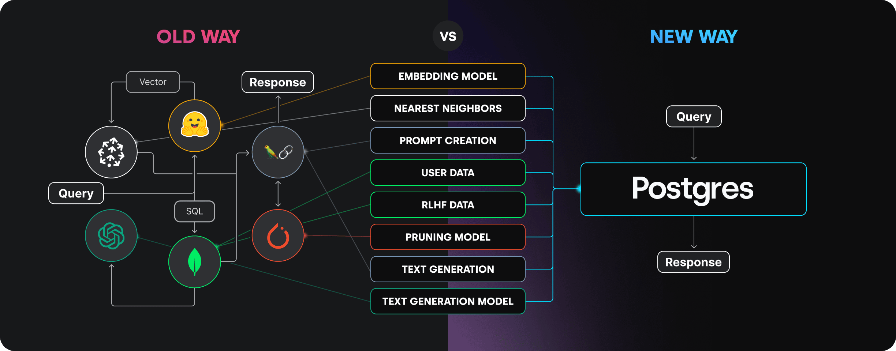

# GPU Query System (RAG Implementation on PostgreSQL)

This project demonstrates **Retrieval-Augmented Generation (RAG)** using a GPU dataset stored in PostgreSQL. The program utilizes Korvus for semantic search and OpenAI's API for natural-language answer generation. It is designed to retrieve relevant data from the PostgreSQL database, augment it with GPT-based insights, and provide coherent answers to user queries.

---

## What is RAG?

**Retrieval-Augmented Generation (RAG)** is a hybrid approach that combines information retrieval with language model generation. The process works in two main steps:

1. **Retrieval**:
   - Relevant documents or data are fetched from a structured or unstructured knowledge base (in this case, PostgreSQL).

2. **Generation**:
   - A language model (like GPT) uses the retrieved context to generate detailed and contextually accurate responses.

This approach ensures that the model provides factually grounded answers based on real data.

---

## Why PostgreSQL?

**PostgreSQL** is a powerful, open-source relational database system that is ideal for implementing RAG. Its key features include:

1. **Advanced Query Capabilities**:
   - PostgreSQL supports complex queries, enabling efficient retrieval of relevant data.

2. **Integration with PostgresML**:
   - This project uses [PostgresML](https://postgresml.org/engine/status), a machine-learning extension for PostgreSQL. PostgresML allows seamless integration of ML models for inference and embedding generation directly within the database.



3. **Scalability**:
   - It handles large datasets efficiently, making it a robust choice for RAG systems.

4. **Flexibility**:
   - PostgreSQL is highly extensible, allowing developers to integrate additional tools and libraries easily.

---

## Features

1. **Dynamic Question Input**:
   - Users can type their questions at runtime, and the system will respond with the most relevant GPU information.

2. **PostgreSQL Integration**:
   - The GPU dataset is stored in a PostgreSQL database, enabling efficient and scalable data retrieval.

3. **PostgresML**:
   - Embedding generation and semantic search capabilities are powered by PostgresML, enhancing retrieval accuracy.

4. **Context-Based Answer Generation**:
   - OpenAI's GPT model processes the retrieved context to provide a natural and informative answer.

---

## Prerequisites

To run this project, ensure you have the following:

1. **Python**:
   - Python 3.8 or above is recommended.

2. **Dependencies**:
   - Install the required libraries using the following command:

     ```bash
     pip install korvus rich openai psycopg2
     ```

3. **PostgreSQL Database with PostgresML**:

```bash
export KORVUS_DATABASE_URL="{YOUR DATABASE CONNECTION STRING}"
```

4. **OpenAI API Key**:
   - You need an OpenAI API key to generate responses.
   - Replace the placeholder `api_key` in the script with your actual OpenAI API key.

---

## Setup and Usage

1. **Clone the Repository**:
   ```bash
   git clone https://github.com/AdityaSeth777/MLSA-Events/RAG
   cd RAG
   ```

2. **Configure PostgreSQL Connection**:
   - Update the database connection details in the script (e.g., `host`, `port`, `user`, `password`, `database`).

3. **Run the Script**:
   ```bash
   python app.py
   ```

4. **Ask a Question**:
   - When prompted, type a question about GPUs. For example:
     ```
     Ask a question about GPUs: What is a budget-friendly option for casual gamers?
     ```

5. **Receive an Answer**:
   - The program will search the PostgreSQL database, retrieve relevant context, and generate a precise answer.

---

## Example

**Input**:
```
Ask a question about GPUs: What is the best GPU for 1080p gaming?
```

**Output**:
```
Search result: 
The NVIDIA GeForce RTX 4060 Ti excels in 1080p gaming with ray tracing and DLSS 3 support.

Model output: 
For 1080p gaming, the NVIDIA GeForce RTX 4060 Ti is a great choice. It offers excellent performance and supports advanced features like ray tracing and DLSS 3.
```

---

## How It Works

1. **Data Retrieval**:
   - The program connects to the PostgreSQL database (with PostgresML) to retrieve GPU descriptions using SQL queries.

2. **Semantic Search**:
   - PostgresML processes the data and identifies the most relevant context based on the user's query.

3. **Answer Generation**:
   - The retrieved context is passed to OpenAI's GPT model to generate a detailed and coherent answer.

---

## Customization

1. **Expand Dataset**:
   - Add more GPU descriptions to the PostgreSQL database to enhance the system's coverage.

2. **Change Models**:
   - Modify the Korvus embedding model or OpenAI GPT model to suit your requirements.

3. **Optimize SQL Queries**:
   - Adjust SQL queries for faster retrieval from the PostgreSQL database, especially with larger datasets.

---

## Limitations

- **Database Size**:
  - The retrieval performance depends on the size and structure of the PostgreSQL database.

- **API Limits**:
  - OpenAI API usage is subject to rate limits and associated costs.

---

## License

This project is open-source and available under the MIT License.

---

## Contributing

Feel free to submit issues or pull requests to enhance the functionality of this project.

---

## Acknowledgments

- [Korvus](https://korvus.ai/) for semantic search capabilities.
- [OpenAI](https://openai.com/) for GPT models.
- [PostgresML](https://postgresml.org/engine/status) for integrating ML capabilities directly into PostgreSQL.
- [Rich](https://github.com/Textualize/rich) for enhanced console output.
